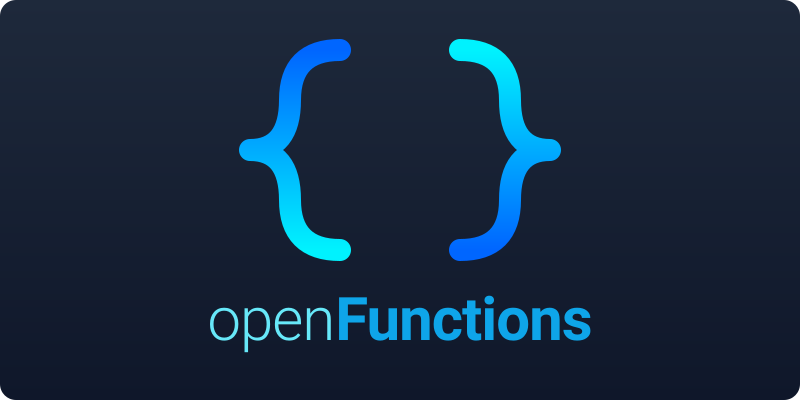

<p align="center">
  
</p>

<p align="center">
  <strong>Build AI tools first. Compose agents when you need them.</strong>
</p>

<p align="center">
  <a href="#quick-start">Quick Start</a> &middot;
  <a href="#the-mental-model">Mental Model</a> &middot;
  <a href="#choose-the-right-primitive">Choose a Primitive</a> &middot;
  <a href="#capability-ladder">Capability Ladder</a> &middot;
  <a href="#providers">Providers</a> &middot;
  <a href="#examples">Examples</a> &middot;
  <a href="#docs">Docs</a>
</p>

<p align="center">
  <sub>
    <a href="docs/i18n/README.ar.md">العربية</a> · <a href="docs/i18n/README.bn.md">বাংলা</a> · <a href="docs/i18n/README.de.md">Deutsch</a> · <a href="docs/i18n/README.es.md">Español</a> · <a href="docs/i18n/README.fr.md">Français</a> · <a href="docs/i18n/README.hi.md">हिन्दी</a> · <a href="docs/i18n/README.id.md">Indonesia</a> · <a href="docs/i18n/README.ja.md">日本語</a> · <a href="docs/i18n/README.ko.md">한국어</a> · <a href="docs/i18n/README.nl.md">Nederlands</a> · <a href="docs/i18n/README.pa.md">ਪੰਜਾਬੀ</a> · <a href="docs/i18n/README.pl.md">Polski</a> · <a href="docs/i18n/README.pt-BR.md">Português</a> · <a href="docs/i18n/README.ru.md">Русский</a> · <a href="docs/i18n/README.sv.md">Svenska</a> · <a href="docs/i18n/README.te.md">తెలుగు</a> · <a href="docs/i18n/README.th.md">ไทย</a> · <a href="docs/i18n/README.tr.md">Türkçe</a> · <a href="docs/i18n/README.uk.md">Українська</a> · <a href="docs/i18n/README.yue.md">粵語</a> · <a href="docs/i18n/README.zh-CN.md">简体中文</a> · <a href="docs/i18n/README.zh-TW.md">繁體中文</a>
  </sub>
</p>

---

openFunctions is an MIT-licensed TypeScript framework for building AI-callable tools and exposing them through [MCP](https://modelcontextprotocol.io), chat adapters, workflows, and agents. Its core runtime is simple:

`ToolDefinition -> ToolRegistry -> AIAdapter`

Everything else composes on top of that:

- `workflows` are deterministic orchestration around tools
- `agents` are LLM loops over a filtered registry
- `structured output` is a synthetic tool pattern
- `memory` and `rag` are stateful systems that can be wrapped back into tools

If you understand the tool runtime, the rest of the framework stays legible.

```text
defineTool() -> registry.register() -> adapter/server executes tool
                                    -> workflows compose tools
                                    -> agents use filtered tools
                                    -> memory/rag expose more tools
```

## Quick Start

```bash
git clone https://github.com/Tom-R-Main/openFunctions.git
cd openFunctions
bash setup.sh
cp .env.example .env
npm run test-tools
```

The first thing to build is a tool, not an agent.

## The Mental Model

A tool is your business logic plus a schema the AI can read:

```typescript
import { defineTool, ok } from "../framework/index.js";

export const rollDice = defineTool({
  name: "roll_dice",
  description: "Roll a dice with the given number of sides",
  inputSchema: {
    type: "object",
    properties: {
      sides: { type: "number", description: "Number of sides (default 6)" },
    },
  },
  handler: async ({ sides }) => {
    const rolled = Math.floor(Math.random() * ((sides as number) || 6)) + 1;
    return ok({ rolled });
  },
});
```

That one definition can be:

- executed directly by `registry.execute()`
- exposed to Claude/Desktop over MCP
- used inside the interactive chat loop
- composed into workflows
- filtered into agent-specific registries

Read more: [Architecture](docs/ARCHITECTURE.md)

## Choose The Right Primitive

| Use this | When you want | What it really is |
|----------|---------------|-------------------|
| `defineTool()` | callable AI-facing business logic | the core primitive |
| `createChatAgent()` | a composable, embeddable AI agent | tools + memory + context + adapter in one config |
| `pipe()` | deterministic orchestration | code-driven tool/LLM pipeline |
| `defineAgent()` | adaptive multi-step tool use | an LLM loop over a filtered registry |
| `createConversationMemory()` / `createFactMemory()` | thread/fact state | persistence plus memory tools |
| `createRAG()` | semantic document retrieval | pgvector + embeddings + tools |
| `connectProvider()` | external system context | structured tools from Siftable, Obsidian, etc. |
| `createStore()` / `createPgStore()` | persistence | storage layer, not retrieval |

Rule of thumb:

- Start with a tool.
- Use `createChatAgent()` when you want a complete agent with memory and context.
- Use a workflow when you know the sequence.
- Use `defineAgent()` when you need specialized agents inside crews.
- Add memory for state you control.
- Add RAG for document retrieval by meaning.
- Add a context provider when you need external systems (tasks, calendars, CRM).

## Capability Ladder

### 1. Build a tool

```bash
npm run create-tool expense_tracker
```

Edit `src/my-tools/expense_tracker.ts`, then run:

```bash
npm run test-tools
npm test
```

### 2. Expose it through MCP or chat

```bash
npm start
npm run chat -- gemini
```

The same registry powers both.

### 3. Compose it with workflows

Workflows are the default “advanced” primitive because the control flow stays explicit:

```typescript
import { pipe, toolStep, llmStep } from "./framework/index.js";

const research = pipe(toolStep(registry, "define_word"))
  .then(async (result) => result.data?.meanings?.[0] ?? "")
  .then(llmStep(adapter, registry, "Explain this simply: {{input}}"));

await research.run({ word: "ephemeral" });
```

### 4. Build a chat agent

`createChatAgent()` composes tools, memory, context providers, and an AI adapter into a single embeddable agent:

```typescript
import { createChatAgent } from "./framework/index.js";

const agent = await createChatAgent({
  provider: "gemini",
  preset: "study-buddy",
  memory: true,                    // conversation + fact memory (on by default)
  providers: ["siftable"],        // connect external context
});

// Use it four ways:
await agent.interactive();                          // CLI
const result = await agent.chat("Create a task");   // programmatic
for await (const chunk of agent.chat("hello", { stream: true })) { ... }  // streaming
await agent.serve({ port: 3000 });                  // HTTP server
```

The same config works from code, CLI flags, or YAML files. Memory is on by default — the agent remembers across sessions.

### 5. Add adaptive behavior with agents

`defineAgent()` is for specialized agents inside crews and workflows — filtered registries and reasoning loops:

```typescript
import { defineAgent } from "./framework/index.js";

const researcher = defineAgent({
  name: "researcher",
  role: "Research Analyst",
  goal: "Find accurate information using available tools",
  toolTags: ["search"],
});
```

Use crews when multiple specialized agents need to collaborate.

### 6. Add state only when needed

Persistence:

```typescript
const tasks = createStore<Task>("tasks");
const tasksPg = await createPgStore<Task>("tasks");
```

Memory:

```typescript
const conversations = createConversationMemory();
const facts = createFactMemory();
registry.registerAll(createMemoryTools(conversations, facts));
```

RAG:

```typescript
const rag = await createRAG({ embeddingProvider: "gemini" });
registry.registerAll(rag.createTools());
```

RAG docs: [docs/RAG.md](docs/RAG.md)

### 7. Connect external context

Context providers bring external systems (task managers, calendars, CRM, knowledge bases) into the agent runtime as tools:

```typescript
import { connectProvider, contextPrompt } from "./framework/index.js";
import { createSiftableProvider } from "./providers/execufunction/index.js";

// Connect — registers tools tagged "context" + "context:siftable"
const sift = await connectProvider(
  createSiftableProvider({ token: process.env.SIFT_TOKEN }),
  registry,
);

// Inject active tasks + upcoming events into agent system prompts
const context = await contextPrompt([sift]);
```

The `ContextProvider` interface is pluggable — implement `metadata`, `connect()`, and `createTools()` to bring any backend into the framework. See [Architecture](docs/ARCHITECTURE.md#context-providers) for the full interface.

| Provider | Status | Capabilities |
|----------|--------|--------------|
| [Siftable](src/providers/execufunction/) | Built-in | human planning, agent work, projects, knowledge, relationships, calendar, code, vault, governed AI and optional datasets |
| Obsidian | Template (planned) | knowledge |
| Notion | Template (planned) | knowledge, tasks, projects |

## Commands

```bash
npm run test-tools          # Interactive CLI — test tools locally
npm run dev                 # Dev mode — auto-restarts on save
npm test                    # Run tool-defined automated tests
npm run typecheck           # Native TypeScript 7 diagnostics
npm run typecheck:ts6       # TypeScript 6 compatibility diagnostics
npm run verify:typescript   # Verify TS7/TS6 ownership and emitted parity
npm run chat                # Chat with AI using your tools
npm run chat -- gemini      # Force a specific provider
npm run chat -- --no-memory # Chat without persistent memory
npm run create-tool <name>  # Scaffold a new tool
npm run docs                # Generate tool reference docs
npm run inspect             # MCP Inspector web UI
npm start                   # Start MCP server for Claude Desktop / Cursor
```

## Providers

Set one API key in `.env` and the chat loop will auto-detect the provider.

Defaults are resolved by workload role, then the exact choice is recorded in
each run manifest. The catalog is dated so model churn stays out of application
code. These are the current defaults for the adapters' default roles:

| Provider | Default role | Current model | API |
|----------|--------------|---------------|-----|
| Gemini | `instant` | `gemini-3.7-flash` | Function calling |
| OpenAI | `expert` | `gpt-5.6-terra` (`medium`) | Responses API |
| Anthropic | `expert` | `claude-sonnet-5` (`medium`) | Messages + adaptive thinking + tool_use |
| xAI | `expert` | `grok-4.5` (`medium`) | Responses API |
| OpenRouter | `instant` | `google/gemini-3.7-flash` | OpenAI-compatible |

Choose a stable role when you do not need to pin a model:

```typescript
const agent = await createChatAgent({
  provider: "openai",
  modelRole: "frontier", // currently gpt-5.6-sol with low reasoning
});
```

Examples:

```bash
npm run chat
npm run chat -- gemini
npm run chat -- openai gpt-5.6-terra
npm run chat -- gemini --prompt study-buddy
```

## Testing

Tests live with tool definitions:

```typescript
defineTool({
  name: "create_task",
  // ...
  tests: [
    { name: "creates a task", input: { title: "Read ch5", subject: "Bio" }, expect: { success: true } },
    { name: "fails without subject", input: { title: "Read ch5" }, expect: { success: false } },
  ],
});
```

The registry validates parameters before handlers run, so schema errors are surfaced clearly enough for both humans and LLMs to recover.

## Examples

| Domain | Tools | Pattern |
|--------|-------|---------|
| Study Tracker | `create_task`, `list_tasks`, `complete_task` | CRUD + Store |
| Bookmark Manager | `save_link`, `search_links`, `tag_link` | Arrays + Search |
| Recipe Keeper | `save_recipe`, `search_recipes`, `get_random` | Nested Data + Random |
| Expense Splitter | `add_expense`, `split_bill`, `get_balances` | Math + Calculations |
| Workout Logger | `log_workout`, `get_stats`, `suggest_workout` | Date Filtering + Stats |
| Dictionary | `define_word`, `find_synonyms` | External API (no key) |
| Quiz Generator | `create_quiz`, `answer_question`, `get_score` | Stateful Game |
| AI Tools | `summarize_text`, `generate_flashcards` | Tool Calls an LLM |
| Utilities | `calculate`, `convert_units`, `format_date` | Stateless Helpers |

## Docs

- [Architecture](docs/ARCHITECTURE.md): the runtime model, filtered registries, synthetic tools, and execution paths
- [Legible runs](docs/RUNS.md): run manifests, outcome claims, verification, assurance, and fulfillment
- [TypeScript 7 and 6](docs/TYPESCRIPT.md): native TS7 builds with the TS6 compatibility/programmatic API
- [Agent runtimes](docs/AGENT-RUNTIMES.md): Hermes MCP, Pi extensions, and current OpenClaw tool plugins
- [Siftable integration](docs/SIFTABLE.md): current MCP/CLI boundaries, auth, tool projection, and drift checks
- [RAG](docs/RAG.md): semantic chunking, Gemini/OpenAI embeddings, pgvector schema, HNSW search, and tool integration

## Integrations

### Siftable context provider

`src/providers/execufunction/` exposes [Siftable](https://siftable.io)
(formerly ExecuFunction) as an openFunctions [`ContextProvider`](src/framework/context.ts).
The provider projects its default tool set directly from the published
[`@siftable/mcp-server`](https://www.npmjs.com/package/@siftable/mcp-server)
SDK. That keeps tool names, schemas, feature gates, transport containment,
work-item lifecycle rules, structured receipts, and execution behavior aligned
with the installed Siftable MCP version. The current `1.2.27` package declares
136 tools; 114 are callable with its default feature flags. Optional dataset
and ontology tools appear automatically when their Siftable feature flags are
enabled. Set `includeLegacyAliases: true` only when migrating callers that still
invoke the old hand-written `exf_*` names.

```ts
import { connectProvider, registry } from "openfunction/framework";
import { createSiftableProvider } from "openfunction/providers/execufunction";

const sift = await connectProvider(createSiftableProvider(), registry);
```

Auth resolution: explicit `{ token }` argument → `SIFT_TOKEN` (current CLI
convention) → `SIFT_PAT` (MCP convention) → legacy `EXF_TOKEN` / `EXF_PAT`.
`sift auth login` saves credentials for the CLI; embedded OpenFunction and
OpenClaw processes still need an explicit token or one of those environment
variables. The API URL and workspace ID retain `SIFT_*` then legacy `EXF_*`
fallbacks.

The ordinary `sift` CLI is the human/operator surface. In the current CLI,
`sift tasks` manages human planning, `sift work` manages the distinct executable
agent queue, `sift capabilities --json` reports readiness, and
`sift doctor --json` diagnoses auth/API/workspace configuration. The separate
interactive TUI is not treated as an MCP transport or as command parity work.

Run `tsx scripts/test-siftable-live.ts` (with `SIFT_TOKEN` or `SIFT_PAT` set) to
verify the provider actually round-trips against your account.

### Agent runtime bridges

OpenFunction now has dependency-free adapters for three external agent hosts:

- **Hermes Agent**: `createHermesMcpConfig()` produces a least-privilege MCP
  configuration fragment with an explicit registry-tool allowlist.
- **Pi (`@earendil-works/pi`)**: `registerPiTools()` and `toPiTools()` produce
  native Pi extension tools with correct throw-on-failure behavior.
- **OpenClaw**: `toOpenclawToolPluginTools()` targets the current
  `defineToolPlugin()` generated-contract path. The existing
  `toOpenclawTools()` adapter remains for mixed or dynamic plugins.

See [Agent runtime integrations](docs/AGENT-RUNTIMES.md) for exact host setup
and compatibility boundaries.

### OpenClaw plugins

`src/framework/openclaw.ts` exports `toOpenclawTools(registry)`, which
converts an openFunctions `ToolRegistry` into the compatibility shape
OpenClaw's `api.registerTool()` expects. The newer
`toOpenclawToolPluginTools()` adapter returns static definitions for
`defineToolPlugin()` and generated `contracts.tools` metadata. Neither bridge
adds an OpenClaw runtime dependency to the framework.

Two reference plugins live in `plugins/`:

- **`openclaw-execufunction/`** — Siftable for OpenClaw. It derives all
  currently enabled tools from `@siftable/mcp-server`, delegates execution to
  the SDK, and generates its static `contracts.tools` manifest from the same
  source. Plugin id `execufunction` remains for config compatibility.
- **`openclaw-openfunctions/`** — Current tool-only reference using
  `defineToolPlugin()`, compiled ESM, and generated manifest metadata. Marked
  `private:true`; it imports the colocated framework by relative path.

Install the Siftable plugin in openclaw:

```bash
openclaw plugins install @openfunctions/openclaw-execufunction
```

Set `SIFT_TOKEN` or `SIFT_PAT` (legacy `EXF_TOKEN` / `EXF_PAT` also work) in
the environment, or use OpenClaw plugin settings.

## Project Structure

```text
openFunctions/
├── src/
│   ├── framework/              # Core runtime + composition layers
│   │   ├── chat-agent.ts       # createChatAgent() — composable chat agent factory
│   │   ├── chat-agent-types.ts # ChatAgent, ChatAgentConfig, ChatResult types
│   │   ├── chat-agent-resolve.ts # Config resolution, provider auto-detection
│   │   ├── chat-agent-http.ts  # HTTP server for agent.serve()
│   │   ├── context.ts          # Context provider interface
│   │   └── ...                 # tool, registry, agents, memory, rag, workflows
│   ├── providers/
│   │   └── execufunction/      # Siftable context provider (wraps @siftable/mcp-server)
│   ├── examples/               # Reference tool patterns
│   ├── my-tools/               # Your tools
│   └── index.ts                # MCP entrypoint
├── plugins/
│   ├── openclaw-execufunction/ # Siftable plugin for openclaw (publishable)
│   ├── openclaw-openfunctions/ # Reference: current tool-plugin bridge (private)
│   └── pi-openfunctions/       # Reference: native Pi extension bridge (private)
├── docs/                       # Architecture docs
├── scripts/                    # chat, create-tool, docs
├── test-client/                # CLI tester + test runner
├── system-prompts/             # Prompt presets
└── package.json
```

## License

MIT — see [LICENSE](LICENSE)
