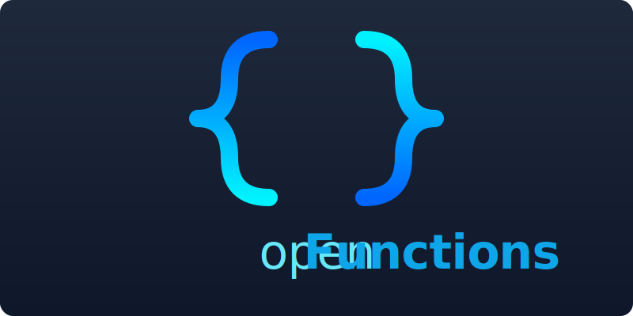

[English](../README.md) | [Thai](README.th.md)

<p align="center">
  
</p>

<p align="center">
  <strong>สร้างเครื่องมือ AI ก่อน แล้วค่อยประกอบเอเจนต์เมื่อคุณต้องการ</strong>
</p>

<p align="center">
  <a href="#quick-start">เริ่มต้นใช้งานด่วน</a> &middot;
  <a href="#the-mental-model">แบบจำลองทางความคิด</a> &middot;
  <a href="#choose-the-right-primitive">เลือก Primitive ที่เหมาะสม</a> &middot;
  <a href="#capability-ladder">ลำดับความสามารถ</a> &middot;
  <a href="#providers">ผู้ให้บริการ</a> &middot;
  <a href="#examples">ตัวอย่าง</a> &middot;
  <a href="#docs">เอกสาร</a>
</p>

---

openFunctions เป็นเฟรมเวิร์ก TypeScript ที่ได้รับอนุญาตภายใต้ MIT สำหรับการสร้างเครื่องมือที่ AI สามารถเรียกใช้งานได้ และเปิดเผยเครื่องมือเหล่านั้นผ่าน [MCP](https://modelcontextprotocol.io), อะแดปเตอร์แชท, เวิร์กโฟลว์ และเอเจนต์ รันไทม์หลักของมันนั้นเรียบง่าย:

`ToolDefinition -> ToolRegistry -> AIAdapter`

ส่วนประกอบอื่น ๆ ทั้งหมดสร้างขึ้นบนพื้นฐานนี้:

- `workflows` คือการจัดลำดับการทำงานที่กำหนดได้รอบเครื่องมือ
- `agents` คือลูป LLM ที่ทำงานบนรีจิสทรีที่ถูกกรอง
- `structured output` คือรูปแบบเครื่องมือสังเคราะห์
- `memory` และ `rag` คือระบบที่มีสถานะซึ่งสามารถนำกลับมาห่อหุ้มเป็นเครื่องมือได้

หากคุณเข้าใจรันไทม์ของเครื่องมือ ส่วนที่เหลือของเฟรมเวิร์กก็จะเข้าใจได้ง่าย

```text
defineTool() -> registry.register() -> adapter/server executes tool // อะแดปเตอร์/เซิร์ฟเวอร์ดำเนินการเครื่องมือ
                                    -> workflows compose tools // เวิร์กโฟลว์ประกอบเครื่องมือ
                                    -> agents use filtered tools // เอเจนต์ใช้เครื่องมือที่ถูกกรอง
                                    -> memory/rag expose more tools // memory/rag เปิดเผยเครื่องมือเพิ่มเติม
```

## เริ่มต้นใช้งานด่วน

```bash
git clone https://github.com/Tom-R-Main/openFunctions.git
cd openFunctions
bash setup.sh
cp .env.example .env
npm run test-tools
```

สิ่งแรกที่ควรสร้างคือเครื่องมือ ไม่ใช่เอเจนต์

## แบบจำลองทางความคิด

เครื่องมือคือตรรกะทางธุรกิจของคุณพร้อมกับสคีมาที่ AI สามารถอ่านได้:

```typescript
import { defineTool, ok } from "../framework/index.js";

export const rollDice = defineTool({
  name: "roll_dice",
  description: "Roll a dice with the given number of sides", // ทอยลูกเต๋าตามจำนวนด้านที่กำหนด
  inputSchema: {
    type: "object",
    properties: {
      sides: { type: "number", description: "Number of sides (default 6)" }, // จำนวนด้าน (ค่าเริ่มต้น 6)
    },
  },
  handler: async ({ sides }) => {
    const rolled = Math.floor(Math.random() * ((sides as number) || 6)) + 1;
    return ok({ rolled });
  },
});
```

คำจำกัดความเดียวนี้สามารถเป็นได้:

- ดำเนินการโดยตรงโดย `registry.execute()`
- เปิดเผยต่อ Claude/Desktop ผ่าน MCP
- ใช้ภายในลูปแชทแบบโต้ตอบ
- ประกอบเข้าเป็นเวิร์กโฟลว์
- ถูกกรองเข้าสู่รีจิสทรีเฉพาะเอเจนต์

อ่านเพิ่มเติม: [สถาปัตยกรรม](docs/ARCHITECTURE.md)

## เลือก Primitive ที่เหมาะสม

| ใช้สิ่งนี้ | เมื่อคุณต้องการ | สิ่งที่เป็นจริง |
|----------|---------------|-------------------|
| `defineTool()` | ตรรกะทางธุรกิจที่ AI เรียกใช้ได้ | primitive หลัก |
| `pipe()` | การจัดลำดับการทำงานที่กำหนดได้ | ไปป์ไลน์เครื่องมือ/LLM ที่ขับเคลื่อนด้วยโค้ด |
| `defineAgent()` | การใช้เครื่องมือหลายขั้นตอนที่ปรับเปลี่ยนได้ | ลูป LLM ที่ทำงานบนรีจิสทรีที่ถูกกรอง |
| `createConversationMemory()` / `createFactMemory()` | สถานะของเธรด/ข้อเท็จจริง | การคงอยู่ของข้อมูลพร้อมเครื่องมือหน่วยความจำ |
| `createRAG()` | การดึงเอกสารเชิงความหมาย | pgvector + embeddings + tools |
| `createStore()` / `createPgStore()` | การคงอยู่ของข้อมูล | เลเยอร์จัดเก็บข้อมูล ไม่ใช่การดึงข้อมูล |

หลักการง่ายๆ:

- เริ่มต้นด้วยเครื่องมือ
- ใช้เวิร์กโฟลว์เมื่อคุณทราบลำดับการทำงาน
- ใช้เอเจนต์เฉพาะเมื่อโมเดลจำเป็นต้องเลือกสิ่งที่จะทำต่อไป
- เพิ่มหน่วยความจำสำหรับสถานะที่คุณควบคุม
- เพิ่ม RAG สำหรับการดึงเอกสารตามความหมาย

## ลำดับความสามารถ

### 1. สร้างเครื่องมือ

```bash
npm run create-tool expense_tracker
```

แก้ไข `src/my-tools/expense_tracker.ts` จากนั้นรัน:

```bash
npm run test-tools
npm test
```

### 2. เปิดเผยผ่าน MCP หรือแชท

```bash
npm start
npm run chat -- gemini
```

รีจิสทรีเดียวกันนี้ขับเคลื่อนทั้งสองอย่าง

### 3. ประกอบเข้ากับเวิร์กโฟลว์

เวิร์กโฟลว์เป็น primitive “ขั้นสูง” เริ่มต้น เนื่องจากกระแสการควบคุมยังคงชัดเจน:

```typescript
import { pipe, toolStep, llmStep } from "./framework/index.js";

const research = pipe(toolStep(registry, "define_word"))
  .then(async (result) => result.data?.meanings?.[0] ?? "")
  .then(llmStep(adapter, registry, "Explain this simply: {{input}}"));

await research.run({ word: "ephemeral" });
```

### 4. เพิ่มพฤติกรรมที่ปรับเปลี่ยนได้ด้วยเอเจนต์

เอเจนต์ใช้เครื่องมือเดียวกัน แต่ผ่านรีจิสทรีที่ถูกกรองและลูปการให้เหตุผล:

```typescript
import { defineAgent } from "./framework/index.js";

const researcher = defineAgent({
  name: "researcher",
  role: "Research Analyst",
  goal: "Find accurate information using available tools",
  toolTags: ["search"],
});
```

ใช้ crews เมื่อเอเจนต์เฉพาะทางหลายตัวจำเป็นต้องทำงานร่วมกัน

### 5. เพิ่มสถานะเมื่อจำเป็นเท่านั้น

การคงอยู่ของข้อมูล:

```typescript
const tasks = createStore<Task>("tasks");
const tasksPg = await createPgStore<Task>("tasks");
```

หน่วยความจำ:

```typescript
const conversations = createConversationMemory();
const facts = createFactMemory();
registry.registerAll(createMemoryTools(conversations, facts));
```

RAG:

```typescript
const rag = await createRAG({ embeddingProvider: "gemini" });
registry.registerAll(rag.createTools());
```

เอกสาร RAG: [docs/RAG.md](docs/RAG.md)

## คำสั่ง

```bash
npm run test-tools          # CLI แบบโต้ตอบ — ทดสอบเครื่องมือในเครื่อง
npm run dev                 # โหมด Dev — รีสตาร์ทอัตโนมัติเมื่อบันทึก
npm test                    # รันการทดสอบอัตโนมัติที่กำหนดโดยเครื่องมือ
npm run chat                # แชทกับ AI โดยใช้เครื่องมือของคุณ
npm run chat -- gemini      # บังคับใช้ผู้ให้บริการเฉพาะ
npm run create-tool <name>  # สร้างโครงสร้างเครื่องมือใหม่
npm run docs                # สร้างเอกสารอ้างอิงเครื่องมือ
npm run inspect             # เว็บ UI ของ MCP Inspector
npm start                   # เริ่มเซิร์ฟเวอร์ MCP สำหรับ Claude Desktop / Cursor
```

## ผู้ให้บริการ

ตั้งค่า API key หนึ่งรายการใน `.env` แล้วลูปแชทจะตรวจจับผู้ให้บริการโดยอัตโนมัติ

| ผู้ให้บริการ | โมเดลเริ่มต้น | API |
|----------|---------------|-----|
| Gemini | `gemini-3-flash-preview` | การเรียกใช้ฟังก์ชัน |
| OpenAI | `gpt-5.4` | API การตอบกลับ |
| Anthropic | `claude-sonnet-4-6` | ข้อความ + การใช้เครื่องมือ |
| xAI | `grok-4.20-0309-reasoning` | API การตอบกลับ |
| OpenRouter | `google/gemini-3-flash-preview` | เข้ากันได้กับ OpenAI |

ตัวอย่าง:

```bash
npm run chat
npm run chat -- gemini
npm run chat -- openai gpt-5.4-pro
npm run chat -- gemini --prompt study-buddy
```

## การทดสอบ

การทดสอบอยู่ร่วมกับคำจำกัดความของเครื่องมือ:

```typescript
defineTool({
  name: "create_task",
  // ...
  tests: [
    { name: "creates a task", input: { title: "Read ch5", subject: "Bio" }, expect: { success: true } }, // สร้างงาน
    { name: "fails without subject", input: { title: "Read ch5" }, expect: { success: false } }, // ล้มเหลวหากไม่มีหัวข้อ
  ],
});
```

รีจิสทรีจะตรวจสอบพารามิเตอร์ก่อนที่แฮนเดลอร์จะทำงาน ดังนั้นข้อผิดพลาดของสคีมาจึงถูกแสดงออกมาอย่างชัดเจนเพียงพอสำหรับทั้งมนุษย์และ LLM ในการแก้ไข

## ตัวอย่าง

| โดเมน | เครื่องมือ | รูปแบบ |
|--------|-------|---------|
| ตัวติดตามการเรียน | `create_task`, `list_tasks`, `complete_task` | CRUD + ที่เก็บข้อมูล |
| ตัวจัดการบุ๊กมาร์ก | `save_link`, `search_links`, `tag_link` | อาร์เรย์ + การค้นหา |
| ที่เก็บสูตรอาหาร | `save_recipe`, `search_recipes`, `get_random` | ข้อมูลซ้อนกัน + สุ่ม |
| ตัวแยกค่าใช้จ่าย | `add_expense`, `split_bill`, `get_balances` | คณิตศาสตร์ + การคำนวณ |
| ตัวบันทึกการออกกำลังกาย | `log_workout`, `get_stats`, `suggest_workout` | การกรองวันที่ + สถิติ |
| พจนานุกรม | `define_word`, `find_synonyms` | API ภายนอก (ไม่มีคีย์) |
| ตัวสร้างแบบทดสอบ | `create_quiz`, `answer_question`, `get_score` | เกมที่มีสถานะ |
| เครื่องมือ AI | `summarize_text`, `generate_flashcards` | เครื่องมือเรียกใช้ LLM |
| ยูทิลิตี้ | `calculate`, `convert_units`, `format_date` | ตัวช่วยที่ไม่มีสถานะ |

## เอกสาร

- [สถาปัตยกรรม](docs/ARCHITECTURE.md): โมเดลรันไทม์, รีจิสทรีที่ถูกกรอง, เครื่องมือสังเคราะห์ และเส้นทางการดำเนินการ
- [RAG](docs/RAG.md): การแบ่งส่วนเชิงความหมาย, การฝังข้อมูล Gemini/OpenAI, สคีมา pgvector, การค้นหา HNSW และการรวมเครื่องมือ

## โครงสร้างโปรเจกต์

```text
openFunctions/
├── src/
│   ├── framework/              # รันไทม์หลัก + เลเยอร์การประกอบ
│   ├── examples/               # รูปแบบเครื่องมืออ้างอิง
│   ├── my-tools/               # เครื่องมือของคุณ
│   └── index.ts                # จุดเข้า MCP
├── docs/                       # เอกสารสถาปัตยกรรม
├── scripts/                    # แชท, สร้างเครื่องมือ, เอกสาร
├── test-client/                # ตัวทดสอบ CLI + ตัวรันการทดสอบ
├── system-prompts/             # ค่าที่ตั้งไว้ล่วงหน้าของ Prompt
└── package.json
```

## ใบอนุญาต

MIT — ดู [LICENSE](LICENSE)